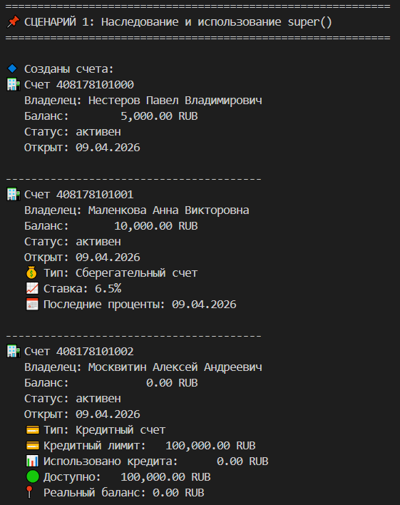
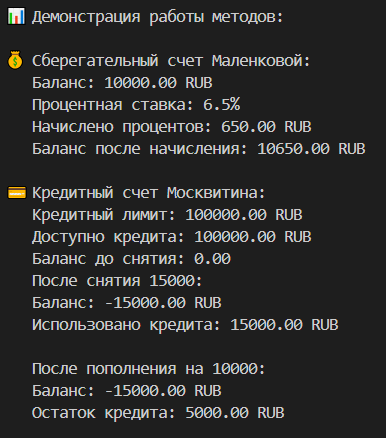
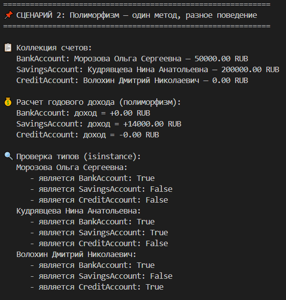
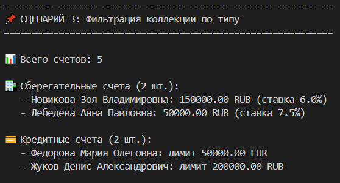

# Лабораторная работа №3 — Наследование и иерархия классов (Вариант 4)

## Цель работы

- Освоить механизм **наследования классов**
- Научиться строить **иерархию объектов**
- Понять разницу между базовым и производным классом
- Научиться **переиспользовать код** через наследование
- Освоить **переопределение методов** и **полиморфизм**

## Описание реализованной иерархии классов

### Базовый класс: `BankAccount`

Базовый класс банковского счета из лабораторной работы №1. Содержит:

- **Атрибуты**: номер счета, владелец, баланс, валюта, статус, дата открытия, история транзакций
- **Методы**: пополнение, снятие, перевод, изменение статуса, получение информации
- **Валидация**: проверка корректности операций в зависимости от статуса счета

### Дочерний класс 1: `SavingsAccount` (Сберегательный счет)

Наследуется от `BankAccount`. Отличительные особенности:

- **Новые атрибуты**:
  - `interest_rate` — процентная ставка (до 20%)
  - `min_balance_maintained` — соблюдение минимального остатка (1000 ед.)
  - `last_interest_date` — дата последнего начисления процентов

- **Новые методы**:
  - `apply_interest()` — начисление процентов на остаток
  - `check_min_balance()` — проверка соблюдения минимального остатка

- **Переопределенные методы**:
  - `calculate_annual_interest()` — расчет годового дохода
  - `__str__()` — расширенное строковое представление

### Дочерний класс 2: `CreditAccount` (Кредитный счет)

Наследуется от `BankAccount`. Отличительные особенности:

- **Новые атрибуты**:
  - `credit_limit` — кредитный лимит (до 50000 ед. по умолчанию)
  - `used_credit` — использованный кредит
  - `interest_on_debt` — процентная ставка на задолженность

- **Новые методы**:
  - `credit_withdraw()` — снятие средств в кредит
  - `calculate_debt_interest()` — расчет процентов по кредиту
  - `available_credit` (property) — доступный кредит

- **Переопределенные методы**:
  - `deposit()` — сначала погашает кредит, остаток на баланс
  - `calculate_annual_interest()` — возвращает отрицательный доход (расходы)
  - `__str__()` — расширенное строковое представление

### Различия между классами

| Характеристика | `BankAccount` | `SavingsAccount` | `CreditAccount` |
|---|---|---|---|
| Баланс может быть отрицательным | ✗ | ✗ | ✓ |
| Начисление процентов | ✗ | ✓ | ✗ (только расходы) |
| Кредитный лимит | ✗ | ✗ | ✓ |
| Особенность пополнения | обычное | обычное | сначала погашает кредит |
| Годовой доход | 0 | положительный | отрицательный |

## Демонстрация работы

### Сценарий 1: Наследование и использование super()

Демонстрирует создание объектов всех трех типов и использование конструктора базового класса через `super()`.

### Сценарий 2: Полиморфизм

Демонстрирует, что один и тот же метод `calculate_annual_interest()` возвращает разные результаты для разных типов счетов.

### Сценарий 3: Работа с коллекцией и фильтрация

Демонстрирует создание коллекции объектов разных типов, фильтрацию по типам с помощью `isinstance()` и дополнительные операции выборки.

---

## Вывод

В ходе выполнения лабораторной работы №3 были изучены и закреплены следующие концепции ООП:

### Наследование
- Создан базовый класс `BankAccount` (из ЛР-1) и два дочерних класса `SavingsAccount` и `CreditAccount`
- Использован `super()` для вызова конструктора базового класса без дублирования кода
- Добавлены новые атрибуты и методы в дочерние классы

### Полиморфизм
- Переопределены методы `__str__()`, `withdraw()`, `deposit()`, `calculate_annual_income()`
- Один и тот же интерфейс методов дает разное поведение в зависимости от типа объекта
- Использован `isinstance()` для проверки типов и фильтрации коллекций
- Избегнут анти-паттерн `if type == ...`

### Работа с коллекциями
- Создана коллекция, хранящая объекты разных типов (наследников `BankAccount`)
- Реализована фильтрация по типам с помощью `isinstance()`
- Продемонстрирована корректная работа полиморфных методов с коллекцией