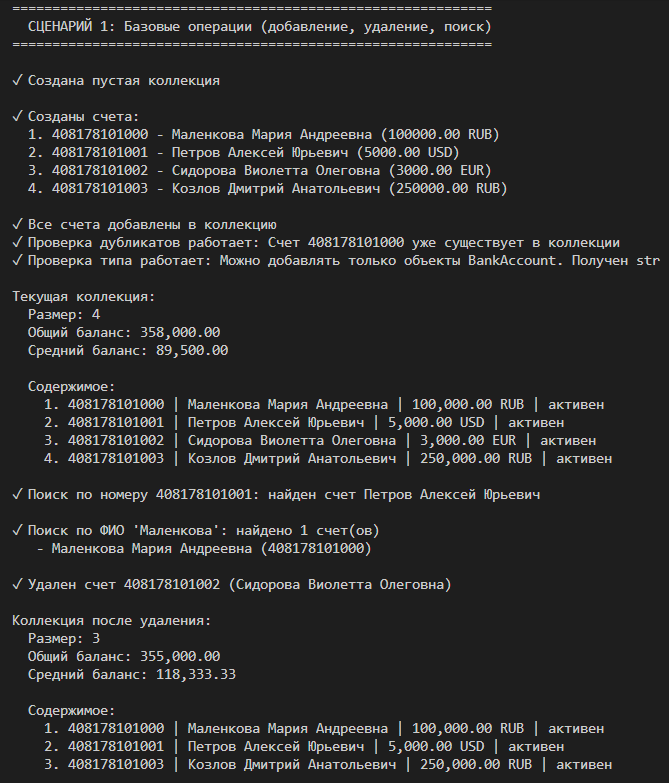
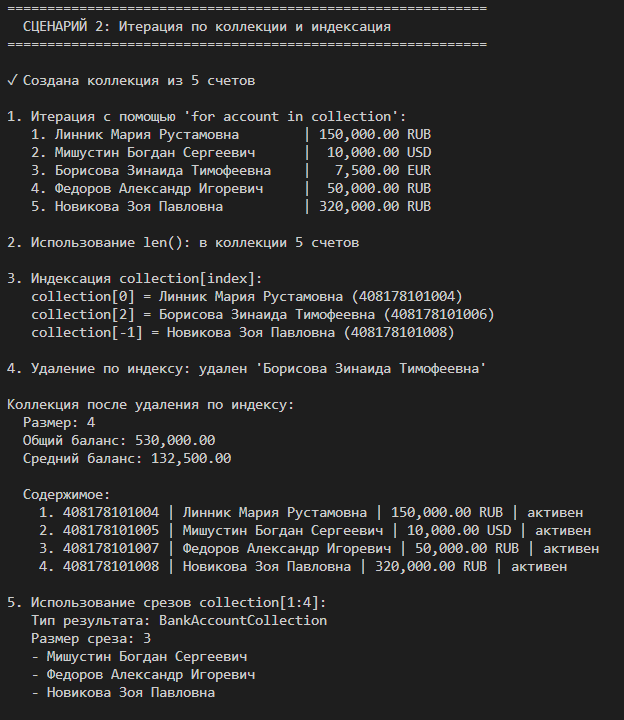
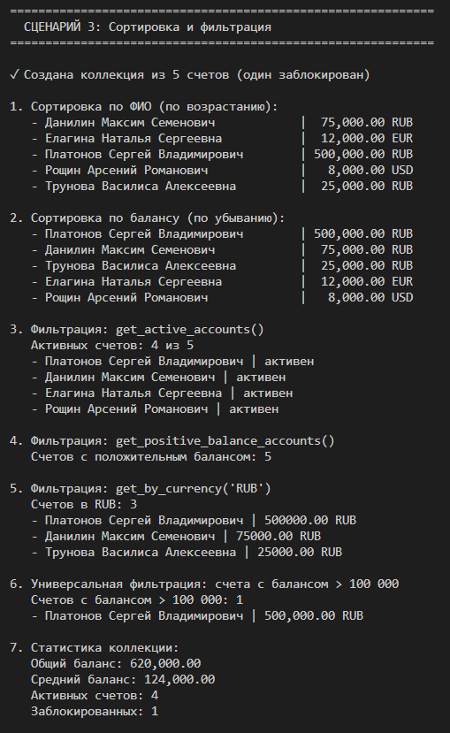
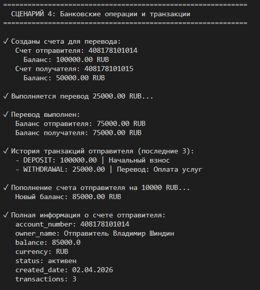

# Лабораторная работа №2: Банковская система 4 вариант 💲💵

## Тема
Реализация контейнерного класса для хранения объектов банковских счетов.

## Цель работы

- Научиться работать с коллекциями объектов
- Понять разницу между моделью сущности и контейнером объектов
- Реализовать собственный контейнерный класс
- Освоить итерацию по объектам
- Реализовать базовые операции управления коллекцией

## Реализованные возможности

### Класс BankAccount (model.py)
- Полностью скопирован из ЛР-1
- Валидация вынесена в отдельный файл `validate.py`
- Поддерживает все операции: пополнение, снятие, перевод

### Класс BankAccountCollection (collection.py)
- Хранение объектов BankAccount в списке
- Проверка типов при добавлении
- Защита от дубликатов

### Методы коллекции
- `add()` - добавление счета
- `remove()` - удаление счета
- `remove_at()` - удаление по индексу
- `get_all()` - получение всех счетов
- `get_by_index()` - получение по индексу

### Поиск
- `find_by_account_number()` - поиск по номеру
- `find_by_owner_name()` - поиск по ФИО
- `find_by_status()` - поиск по статусу
- `find_by_min_balance()` - поиск по минимальному балансу
- `find_by_currency()` - поиск по валюте

### Сортировка
- `sort_by_owner_name()` - по ФИО
- `sort_by_balance()` - по балансу
- `sort_by_account_number()` - по номеру счета
- `sort_by_created_date()` - по дате создания
- `sort()` - универсальная сортировка

### Фильтрация (возвращают новые коллекции)
- `get_active_accounts()` - активные счета
- `get_positive_balance_accounts()` - счета с положительным балансом
- `get_by_currency()` - счета в указанной валюте
- `get_filtered()` - универсальная фильтрация

### Магические методы
- `__len__()` - длина коллекции
- `__getitem__()` - индексация и срезы
- `__iter__()` - итерация
- `__contains__()` - оператор `in`

### Статистика
- `total_balance()` - общий баланс
- `average_balance()` - средний баланс
- `count_by_status()` - количество по статусу

**Сценарий 1: Базовые операции с коллекцией**

Что демонстрируется:

- Создание пустой коллекции банковских счетов
- Создание 5 счетов с разными владельцами и валютами
- Добавление счетов в коллекцию методом add()
- Проверка защиты от дубликатов (нельзя добавить счет дважды)
- Проверка типа добавляемых объектов (только BankAccount)
- Поиск счета по номеру через find_by_account_number()
- Поиск счетов по ФИО с частичным совпадением find_by_owner_name()
- Поиск по точному совпадению ФИО
- Поиск по фамилии через find_by_last_name()
- Поиск по любой части ФИО через find_by_name_contains()
- Удаление счета из коллекции методом remove()
- Вывод всех счетов через get_all()

*Показывает, что коллекция правильно управляет объектами, защищает от добавления дубликатов и объектов неправильного типа, а поиск работает гибко и регистронезависимо.*

**Сценарий 2: Итерация и индексация**

- Использование len(collection) для получения размера коллекции
- Итерация по коллекции через for account in collection
- Доступ к элементам по индексу: collection[0], collection[2], collection[-1]
- Использование срезов: collection[1:4]
- Удаление элемента по индексу через remove_at(index)
- Проверка работы __getitem__ с отрицательными индексами
- Проверка работы __iter__ для обхода всех элементов
- Обработка ошибок при выходе за границы коллекции

*Коллекция поддерживает все стандартные протоколы Python для работы с последовательностями: получение длины, итерацию, индексацию и срезы.*

**Сценарий 3: Сортировка и фильтрация**

Что демонстрируется:

Сортировка:
- Сортировка по ФИО владельца через sort_by_owner_name()
- Сортировка по балансу через sort_by_balance(reverse=True)
- Сортировка по номеру счета через sort_by_account_number()
- Сортировка по дате создания через sort_by_created_date()
- Универсальная сортировка через sort(key, reverse)

Фильтрация (возвращает новые коллекции):
- Получение активных счетов через get_active_accounts()
- Получение счетов с положительным балансом через get_positive_balance_accounts()
- Получение счетов в определенной валюте через get_by_currency()
- Универсальная фильтрация через get_filtered(predicate)

Статистика:
- Общий баланс всех счетов через total_balance()
- Средний баланс через average_balance()
- Количество счетов по статусу через count_by_status()

*Коллекция поддерживает гибкую сортировку по разным критериям, фильтрацию с созданием новых коллекций (без изменения исходной) и расчет статистики.*

**Сценарий 4: Банковские операции и транзакции**

Что демонстрируется:

- Создание двух счетов для выполнения переводов
- Выполнение перевода между счетами через transfer()
- Проверка изменения балансов после перевода
- Пополнение счета через deposit() с указанием описания
- Просмотр истории транзакций через get_transaction_history()
- Получение полной информации о счете через get_account_info()
- Работа с различными валютами счетов
- Обработка ошибок при переводе между разными валютами

*Счета корректно выполняют банковские операции, ведут историю транзакций и предоставляют полную информацию о своем состоянии.*