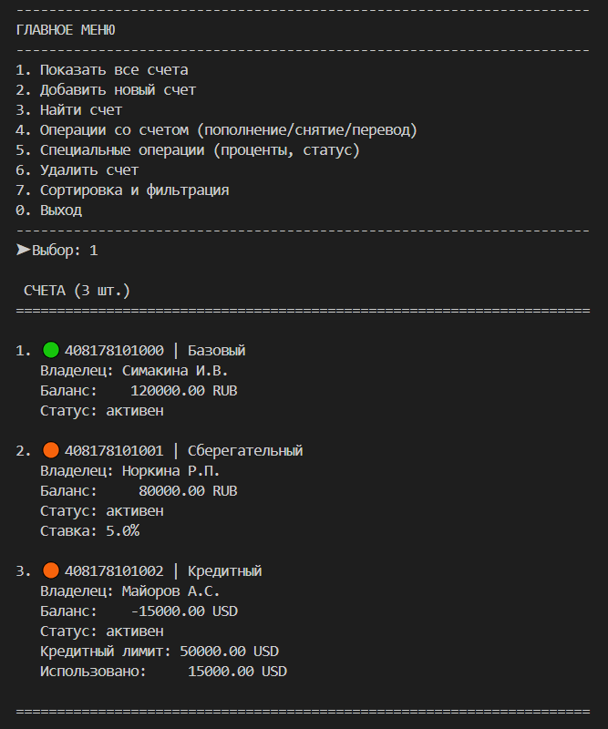
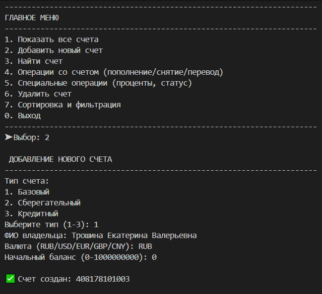
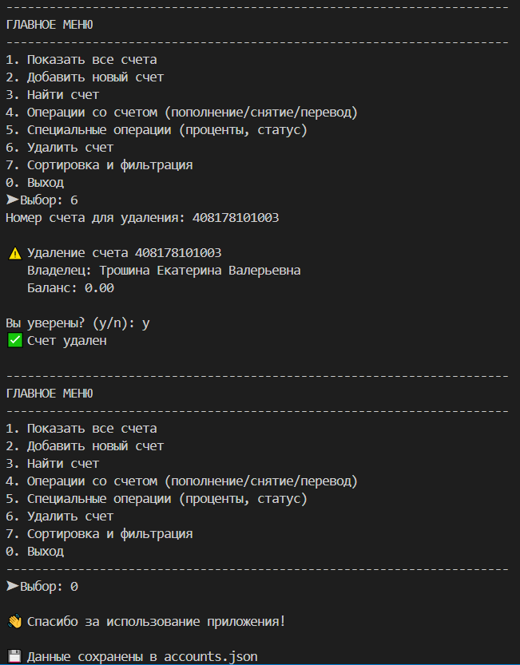
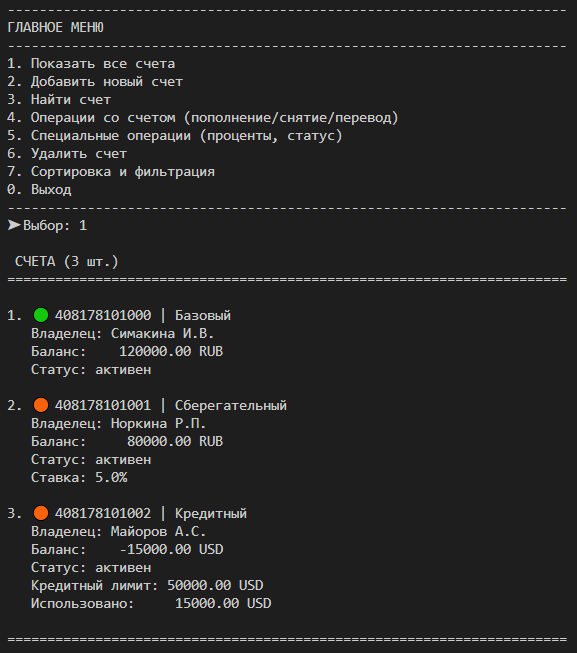
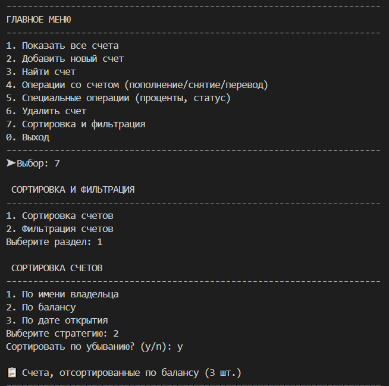
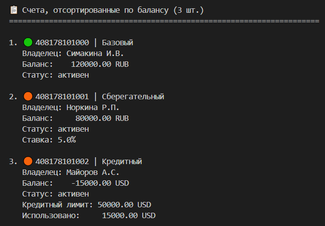
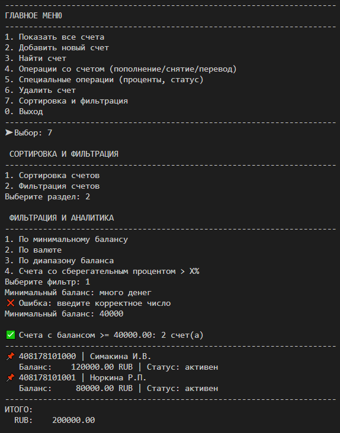

# Лабораторная работа №7 — Консольное приложение управления банковскими счетами

## Цель работы

Объединить знания, полученные в ЛР1–ЛР6, в единое работающее консольное приложение (CLI) с интерактивным меню для управления банковскими счетами. Реализовать полное разделение на слои (CLI → Бизнес-логика → Хранилище), собственные исключения, сохранение/загрузку данных, типизацию и документирование кода.

---

## Реализованные типы счетов

1. **BankAccount** — базовый счет (баланс ≥ 0)
2. **SavingsAccount** — сберегательный счет (начисление процентов)
3. **CreditAccount** — кредитный счет (кредитный лимит, отрицательный баланс)

---

## Структура проекта

```
lab07/
├── main.py              # Точка входа, управление жизненным циклом приложения
├── cli.py               # Интерфейс меню, ввод/вывод
├── app.py               # Бизнес-логика, операции со счетами
├── storage.py           # Сохранение/загрузка данных в JSON
├── exceptions.py        # Собственные исключения
├── accounts.json        # Файл хранилища (создается при первом сохранении)
└── README.md           # Данная документация
```

### Описание файлов

| Файл | Назначение |
|------|-----------|
| `main.py` | Инициализация приложения, загрузка данных, управление жизненным циклом |
| `cli.py` | Класс `BankCLI` — все операции ввода/вывода и интерфейс меню |
| `app.py` | Класс `BankApp` — вся бизнес-логика (CRUD счетов, операции, поиск) |
| `storage.py` | Функции загрузки/сохранения в JSON, сериализация/десериализация |
| `exceptions.py` | Иерархия собственных исключений (7 типов) |

---

## Функции приложения

### Основное меню (7 пунктов)

1. **Показать все счета** — таблица всех счетов с форматированием
2. **Добавить новый счет** — создание базового, сберегательного или кредитного счета
3. **Найти счет** — поиск по номеру, имени владельца или статусу
4. **Операции со счетом** — пополнение, снятие, переводы между счетами
5. **Специальные операции** — начисление процентов, изменение статуса, история
6. **Удалить счет** — удаление с проверкой баланса и подтверждением
7. **Фильтрация и аналитика** — фильтрация по условиям, подсчет итогов

### Поддерживаемые операции

#### Создание счетов
- Ввод: ФИО, валюта (RUB/USD/EUR/GBP/CNY), начальный баланс
- Для сберегательного: процентная ставка (0–20%)
- Для кредитного: лимит кредита, процент по долгу (0–30%)
- Валидация всех данных при вводе

#### Операции со средствами
- **Пополнение** — добавление денег на счет
- **Снятие** — снятие денег (для кредита доступны кредитные средства)
- **Перевод** — перечисление между двумя счетами (проверка валют)

#### Специальные операции
- **Начисление процентов** — для сберегательных счетов
- **Смена статуса** — активирован, заблокирован, заморожен
- **История транзакций** — последние 10 операций

#### Фильтрация и поиск
- По минимальному балансу
- По валюте
- По диапазону баланса
- По процентной ставке
- По статусу счета
- По имени владельца

#### Сортировка
- Встроенная сортировка в фильтрации (по счетам, сумме, статусу)

---

## Обработка ошибок и исключений

### Собственные исключения (`exceptions.py`)

```python
BankAppException              # Базовое исключение приложения
├── AccountNotFoundError      # Счет не найден
├── DuplicateAccountError     # Счет уже существует
├── InvalidAccountTypeError   # Неверный тип счета
├── InsufficientFundsError    # Недостаточно средств
├── OperationError            # Ошибка при операции
└── StorageError              # Ошибка хранилища
```

### Обработка некорректного ввода

- **Неверный пункт меню** → циклический повтор меню с сообщением об ошибке
- **Ввод строки вместо числа** → перепромпт с указанием на ошибку
- **Операции на заблокированных счетах** → `OperationError` с описанием
- **Удаление счета с ненулевым балансом** → ошибка до подтверждения
- **Неверная валюта** → проверка из списка `VALID_CURRENCIES`

### Практика обработки

Все ошибки оборачиваются в `try-except` блоки на уровне CLI, что отделяет обработку ошибок от бизнес-логики.

---

## Сохранение и загрузка данных

### Формат JSON

Файл `accounts.json` содержит:
- Времяпечать сохранения
- Список счетов с полной информацией:
  - Номер счета, ФИО, баланс, валюта, статус, дата открытия
  - Для сберегательного: процентная ставка
  - Для кредитного: лимит, использованный кредит, процент по долгу
  - История всех транзакций

### Процесс загрузки/сохранения

1. **При запуске** (`main.py`):
   - Попытка загрузить `accounts.json`
   - Если файл существует → загрузка счетов в приложение
   - Если файл отсутствует → начало с пустой коллекции

2. **При выходе**:
   - Все очищенные счета сохраняются в `accounts.json`
   - Сообщение подтверждает сохранение

### Обработка ошибок хранилища

- `StorageError` при ошибке JSON, доступе к файлу
- Приложение продолжает работу даже при ошибке загрузки (с предупреждением)

---

## Типизация и документирование

### Аннотации типов

Все методы в `app.py`, `cli.py` имеют полные аннотации:
```python
def add_account(self, account: BankAccount) -> None:
    ...

def deposit(self, account_number: str, amount: float) -> None:
    ...

def filter_accounts(self, predicate: Callable[[BankAccount], bool]) -> List[BankAccount]:
    ...
```


---

## Подтверждение опасных операций

При удалении счета пользователю показывается:
1. Информация о счете (номер, владелец, баланс)
2. Запрос подтверждения: `Вы уверены? (y/n):`
3. Выполнение операции только при ответе `y`

---

## Демонстрация работы

### Сценарий 1 — запуск, автозагрузка и вывод коллекции

**Описание:** Демонстрация автоматического восстановления состояния приложения. При старте программа считывает данные из `accounts.json`, десериализует объекты и выводит их в виде отформатированной таблицы.

**Действия в CLI:**
1. Запустить приложение
2. Дождаться сообщения об автозагрузке из `accounts.json`.
3. Нажать `1` — `Показать все счета`.
4. Показать список счетов, уже загруженных из файла.

**Результат:**
- сообщение об успешной загрузке данных;
- главное меню;
- таблица/список счетов.




### Сценарий 2 — добавление, удаление с подтверждением и повторный запуск

**Описание:** Проверка безопасности операций вывода и персистентности данных. Сценарий показывает полное создание объекта через меню, перехват опасной операции (запрос подтверждения `y/n` перед удалением счета) и автоматическое сохранение состояния при выходе.

**Действия в CLI:**
1. Нажать `2` — `Добавить новый счет`.
2. Выбрать тип счета и ввести данные.
3. Запомнить номер созданного счета.
4. Нажать `6` — `Удалить счет`.
5. Ввести номер счета и подтвердить удаление через `y`.
6. Выйти из программы через `0`.
7. Запустить приложение ещё раз и показать, что данные снова загрузились из файла.

**Результат:**
- создание нового счета;
- запрос подтверждения удаления `y/n`;
- сообщение о сохранении при выходе;
- повторный запуск с автозагрузкой.





### Сценарий 3 — сортировка с выбором стратегии через меню

**Описание:** Демонстрация гибкости сортировки (на основе паттерна "Стратегия"). В зависимости от выбора пользователя, приложение динамически подменяет функцию-компаратор, сортируя объекты по имени владельца, балансу или дате создания.

**Действия в CLI:**
1. Нажать `7` — `Сортировка и фильтрация`.
2. Нажать `1` — `Сортировка счетов`.
3. Выбрать стратегию:
   - `1` — по имени владельца;
   - `2` — по балансу;
   - `3` — по дате открытия.
4. При необходимости выбрать `y/n` для сортировки по убыванию.

**Результат:**
- меню сортировки;
- выбор стратегии;
- отсортированный список счетов.






### Сценарий 4 — фильтрация + перехват исключения

**Описание:** Проверка отказоустойчивости приложения и работы блока пользовательских исключений. Демонстрируется успешная фильтрация счетов по критерию и реакция программы на некорректный ввод (текст вместо числа) — приложение не падает, а перехватывает исключение и просит повторить ввод.

**Действия в CLI:**
1. Нажать `7` — `Сортировка и фильтрация`.
2. Нажать `2` — `Фильтрация счетов`.
3. Выбрать фильтр, например `1` — `По минимальному балансу`.
4. Ввести значение и показать результат фильтрации.
5. Затем специально ввести неверный пункт меню, например `9`, чтобы показать обработку ошибки.

**Ожидаемый результат:**
- работа фильтрации;
- форматированный вывод результатов;
- сообщение об ошибке при неверном выборе или вводе.





## Вывод

В ходе выполнения лабораторной работы было изучено и применено на практике:
* **Разбиение на модули и слои**: приложение разделено на взаимодействующие слои (`cli.py` — интерфейс, `app.py` — бизнес-логика, `storage.py` — работа с данными).
* **CLI-интерфейс**: реализовано интерактивное консольное меню с циклом работы, фильтрацией, сортировкой и защитой от неверного пользовательского ввода.
* **Обработка исключений**: создана изолированная иерархия собственных исключений (`BankAppException` и 6 наследников) для безопасной обработки ошибок предметной области, чтобы программа не падала при ошибках.
* **Работа с файлами**: освоена сериализация и десериализация сложных ООП-объектов в формат JSON для персистентного хранения данных между запусками.
* **Типизация**: внедрены строгие аннотации типов (Type Hints) для всех методов.
