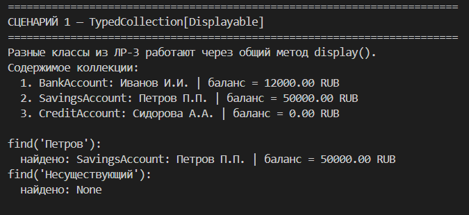
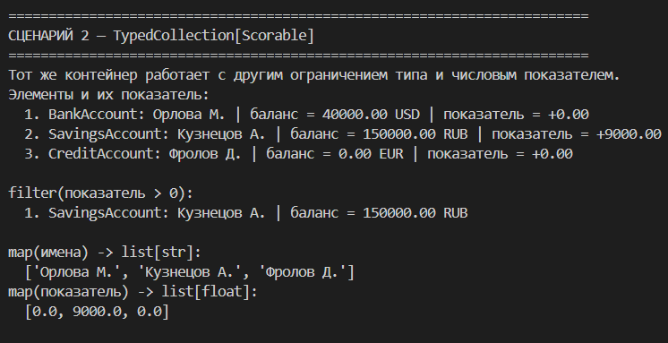

# Лабораторная работа №6 — Generics и typing

## 1. Цель работы

- Освоить аннотации типов в Python (`typing`).
- Реализовать обобщенный контейнер через `TypeVar` и `Generic`.
- Понять структурную типизацию через `Protocol`.

## 2. Описание реализованных типов и контейнеров

В `src/lab06/container.py` реализованы:

- `TypedCollection[T]` — generic-коллекция с методами:
  - `add(item: T) -> None`
  - `remove(item: T) -> None`
  - `to_list() -> list[T]`
  - `find(predicate: Callable[[T], bool]) -> Optional[T]`
  - `filter(predicate: Callable[[T], bool]) -> list[T]`
  - `map(transform: Callable[[T], R]) -> list[R]`

- `TypeVar`:
  - `T` — тип элемента коллекции
  - `R` — тип результата для `map`
  - `D = TypeVar("D", bound=Displayable)`
  - `S = TypeVar("S", bound=Scorable)`

- `Protocol`:
  - `Displayable` — объект должен иметь `display() -> str`
  - `Scorable` — объект должен иметь `score() -> float`

Для демонстрации используются объекты из ЛР-3 (`BankAccount`, `SavingsAccount`, `CreditAccount`), которые подходят под Protocol по наличию методов (без явного наследования от Protocol).

### Сценарий 1: `TypedCollection[Displayable]`

- Создается коллекция с ограничением `Displayable`.
- Добавляются объекты разных типов из ЛР-3.
- Вызывается `display()` для каждого элемента.
- Демонстрируется `find()`:
  - случай, когда элемент найден,
  - случай, когда возвращается `None`.

### Сценарий 2: `TypedCollection[Scorable]`

- Создается коллекция с ограничением `Scorable`.
- Для каждого элемента выводится числовой показатель.
- Демонстрируется `filter()` по условию.
- Демонстрируется `map()` с изменением типа результата:
  - `map(owner_name) -> list[str]`
  - `map(показатель) -> list[float]`

## 4. Вывод

- Добавлены аннотации типов и generic-контейнер
- Реализованы `find`, `filter`, `map` с корректной типизацией.
- Реализованы два `Protocol` и ограничения `bound=` для `TypeVar`.
- Показана структурная типизация: разные классы из ЛР-3 работают через общий Protocol без явного наследования.
