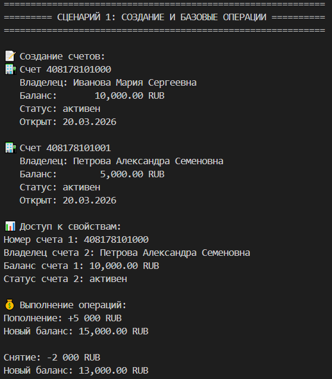
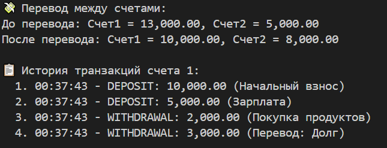
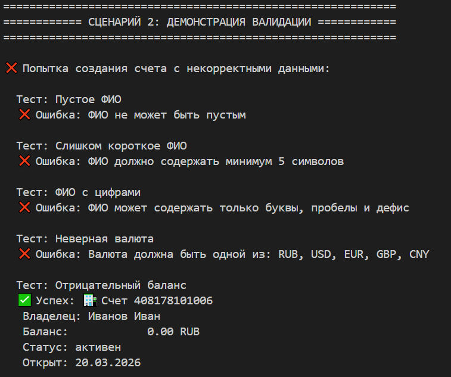
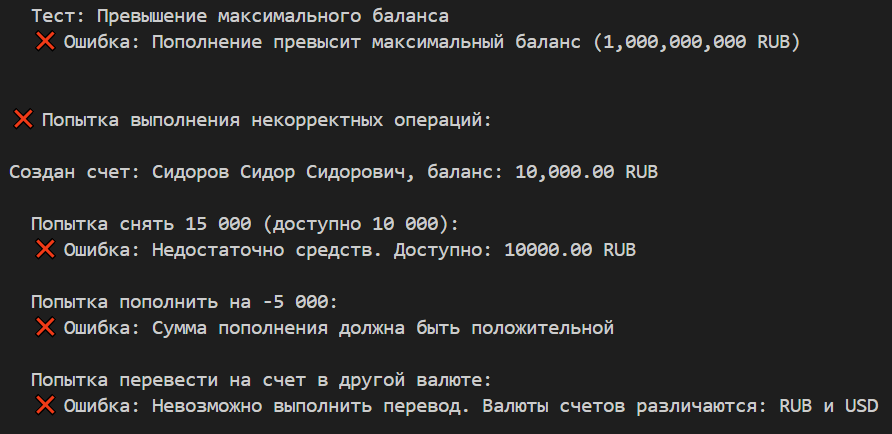
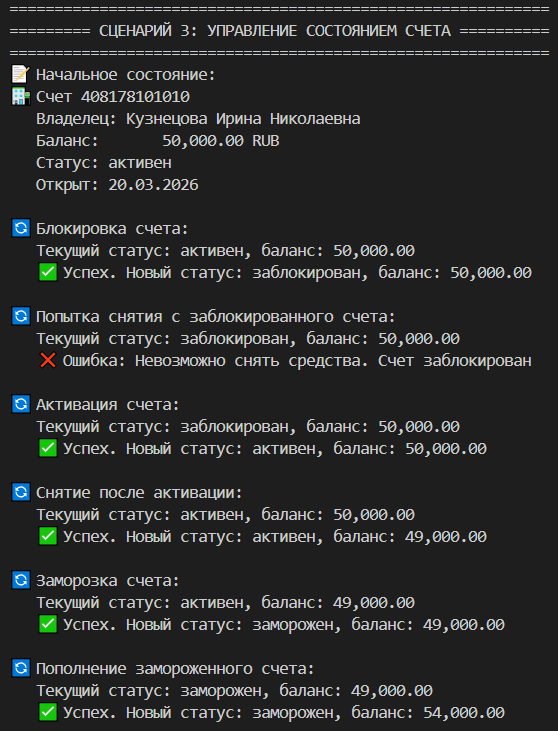
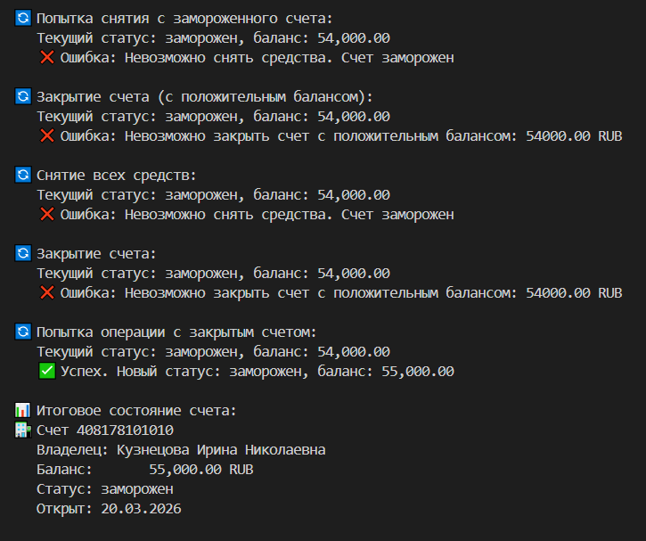
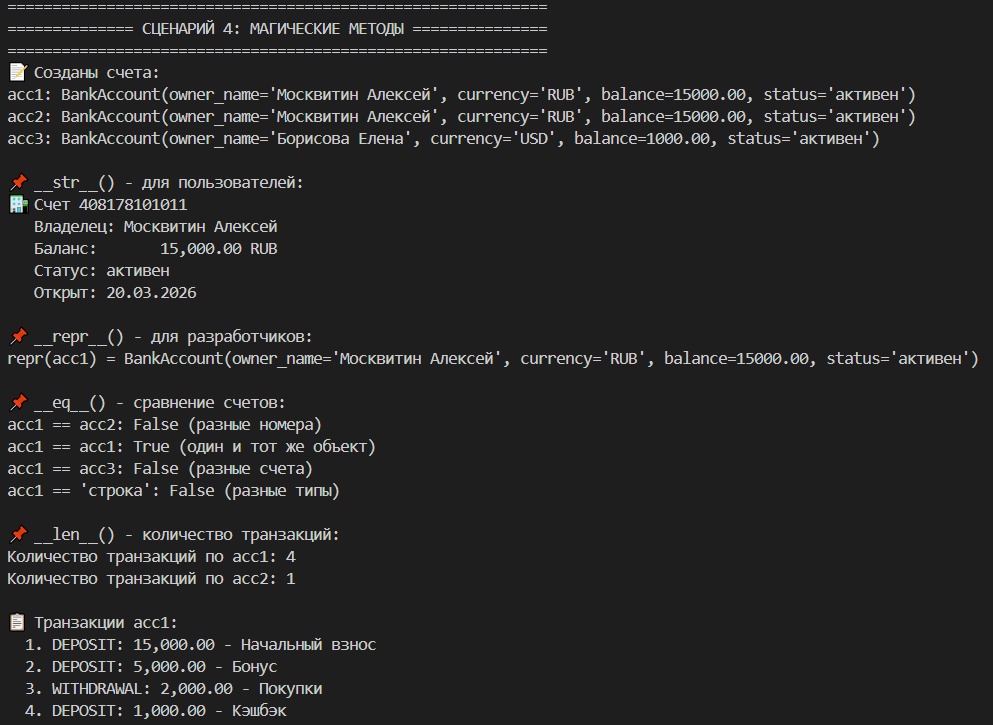

# Лабораторная работа №1: Банковская система 4 вариант 💳

## Цель работы

- Освоить объявление пользовательских классов
- Разобраться с инкапсуляцией (закрытые поля)
- Реализовать свойства (`@property`)
- Переопределить магические методы (`__str__`, `__repr__`, `__eq__`)
- Понять разницу между атрибутами класса и экземпляра

**Задумка**
Создать "умный" банковский счет, который:

~ Сам следит за корректностью данных (валидация)

~ Запрещает недопустимые операции (снятие больше баланса, действия с заблокированным счетом)

~ Предоставляет удобный интерфейс через свойства (@property)

## Реализованный класс

**BankAccount**
```python
class BankAccount:
    # Атрибуты класса
    _account_counter = 1000
    MAX_BALANCE = 1_000_000_000.0
    MIN_BALANCE = 0.0
    VALID_CURRENCIES = ["RUB", "USD", "EUR", "GBP", "CNY"]
```
Главный класс, моделирующий банковский счет. Содержит всю логику работы со счетом.

**Атрибуты класса:**

_account_counter — счетчик для генерации номеров счетов
MAX_BALANCE — максимально допустимый баланс
MIN_BALANCE — минимально допустимый баланс
VALID_CURRENCIES — список допустимых валют

**Закрытые поля:**
- `__account_number` - номер счета (генерируется автоматически)
- `__owner_name` - ФИО владельца
- `__balance` - текущий баланс
- `__currency` - валюта счета
- `__status` - статус счета (активен/заблокирован/закрыт/заморожен)
- `__created_date` - дата открытия
- `__transactions` - история операций

**Свойства @property:**
- Чтение: account_number — номер счета
- Чтение и запись: owner_name — имя владельца (с валидацией)
- Чтение: balance — баланс счета
- Чтение и запись: currency — валюта счета (с валидацией)
- Чтение: status — статус счета
- Чтение: created_date — дата открытия
- Чтение: transaction_count — количество транзакций

**Магические методы:**
- `__str__` — для print (читаемое описание с эмодзи)
- `__repr__` — для разработчиков
- `__eq__` — сравнение по номеру счета
- `__lt__` - cравнение по балансу

**Бизнес-методы:**
- deposit(amount, description) — пополнение счета
- withdraw(amount, description) — снятие со счета
- transfer(to_account, amount, description) — перевод на другой счет
- get_transaction_history(limit) — история операций
- get_account_info() — полная информация о счете

**Методы изменения состояния:**

- activate() — активация счета
- block() — блокировка счета
- freeze() — заморозка счета
- close() — закрытие счета

**Методы валидации:**

- _validate_owner_name(name) — проверка ФИО
- _validate_currency(currency) — проверка валюты
- _validate_balance_limit(amount) — проверка лимитов баланса
- _validate_withdrawal(amount) — проверка возможности снятия
- _validate_deposit(amount) — проверка возможности пополнения

**Сценарий 1: Создание счетов**




Что демонстрируется:

- Создание двух счетов с разными владельцами
- Доступ к свойствам через геттеры
- Пополнение счета на 5000 руб.
- Снятие со счета 2000 руб.
- Перевод 3000 руб. между счетами
- Просмотр истории транзакций

*Показывает, что каждый счет получает свой номер (ACC1000, ACC1001...), а значения по умолчанию применяются корректно.*

**Сценарий 2: Валидация (обработка ошибок)**




- Некорректные имена (пустые, короткие, с цифрами)
- Отрицательный баланс
- Превышение максимального баланса
- Некорректная процентная ставка

*Программа намеренно пытается создать счета с некорректными данными, чтобы продемонстрировать защиту от ошибок.*


**Сценарий 3: Управление состоянием (жизненный цикл счета)**



Что демонстрируется:

- Блокировка счета
- Попытка снятия с заблокированного счета (Ошибка)
- Активация счета
- Снятие после активации
- Заморозка счета
- Пополнение замороженного счета
- Попытка снятия с замороженного счета (Ошибка)
- Снятие всех средств
- Закрытие счета
- Попытка операции с закрытым счетом (Ошибка)

**Сценарий 4: Магические методы**



Что демонстрируется:

- __str__ (пользовательский вывод)
- __repr__ (отладочный вывод)
- __eq__ (сравнение счетов)

    acc1 == acc2 → False (разные номера)

    acc1 == acc1 → True (один и тот же объект)

    acc1 == 'строка' → False (разные типы)

- __len__ (количество транзакций):

    После 3 операций: len(acc1) → 3