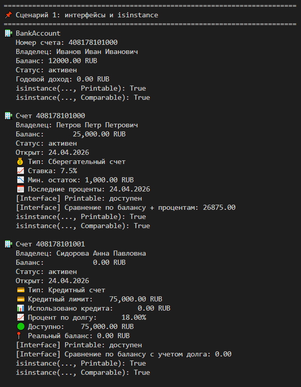
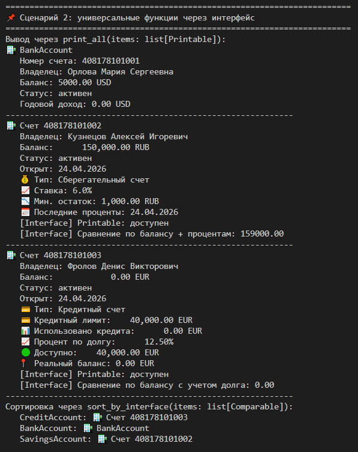
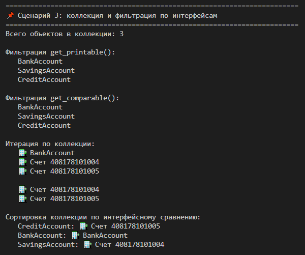

# Лабораторная работа №4 — Интерфейсы и абстрактные классы (ABC)

## 1. Цель работы

В ходе работы были изучены:

- интерфейсы как контракт поведения;
- абстрактные базовые классы (`ABC`);
- реализация нескольких интерфейсов в одних и тех же классах;
- полиморфизм через единый интерфейс;
- использование `isinstance()` для проверки интерфейсов;
- сортировка и фильтрация объектов через интерфейс.

---

## 2. Описание интерфейсов

В лабораторной реализованы два интерфейса:

### `Printable`

Требует реализации метода:

- `to_string()` — возвращает строковое представление объекта.

### `Comparable`

Требует реализации метода:

- `compare_to(other)` — сравнивает текущий объект с другим и возвращает `-1`, `0` или `1`.

---

## 3. Реализация в классах

Интерфейсы реализованы в следующих классах:

- `BankAccount`
- `SavingsAccount`
- `CreditAccount`

### Отличия поведения

- `Printable` позволяет по-разному форматировать строковое представление объекта в зависимости от класса.
- `Comparable` позволяет сравнивать объекты по разным числовым метрикам:
  - `BankAccount` — по текущему балансу;
  - `SavingsAccount` — по балансу с учетом начисленных процентов;
  - `CreditAccount` — по балансу с учетом задолженности.

Все эти классы одновременно реализуют **оба интерфейса**.

---

## 4. Демонстрация

В `demo.py` показаны три сценария:

1. создание объектов разных типов и проверка `isinstance()`;

2. универсальная печать через функцию `print_all(items: list[Printable])`;

3. сортировка через `sort_by_interface(items: list[Comparable])`;
4. работа с коллекцией `InterfaceCollection`, которая умеет:
   - хранить объекты;
   - фильтровать по интерфейсам;
   - сортировать по интерфейсному сравнению.

